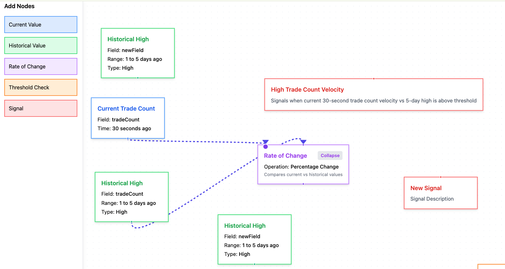

# 🚀 React Flow Tutorial

This repository demonstrates the **core concepts** of [React Flow](https://reactflow.dev/), a powerful **node-based UI editor framework**. It provides an interactive way to model **connections, logic, and workflows** using draggable nodes.



## 📌 Key Concepts

### 🔹 **Node Types**
- Nodes represent **components or objects** in a flow-based diagram.
- Each node has a **type** that defines its appearance and behavior.

### 🔹 **Handles**
- Handles are the **connection points** on a node.
- `source` handles **output data**, while `target` handles **receive input**.

### 🔹 **Connections (Edges)**
- Edges define **relationships** between nodes.
- Connections can be **validated** to enforce correct linking.

## 🎯 What This Tutorial Covers
This tutorial creates a simple **stream signal modeling system** where:
- Nodes represent **functions & values**.
- Connections define **data flow & computation**.
- React Flow is used to **visualize & interact** with the model.

## 🚀 Getting Started

### 1️⃣ **Clone the Repository**
```sh
git clone <your-repo-url>
cd react-flow-tutorial
